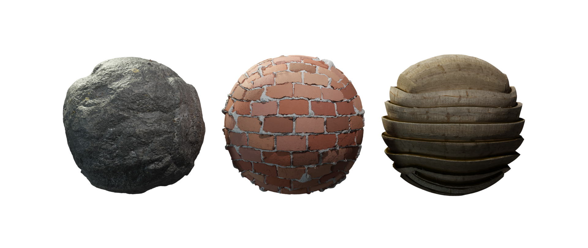
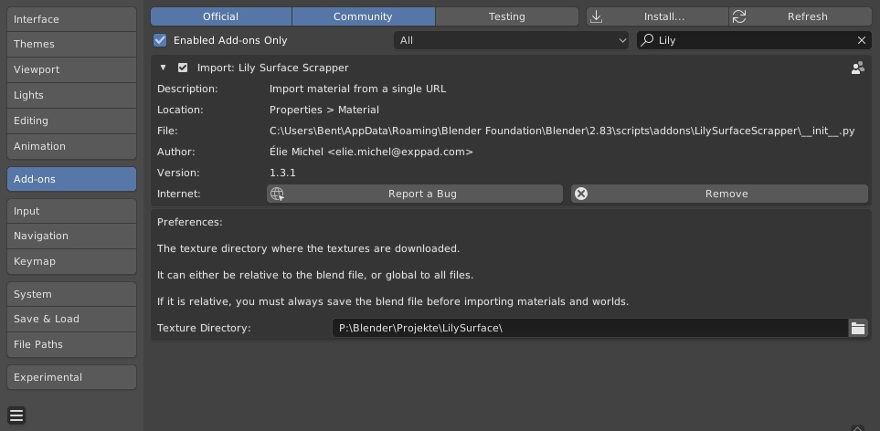
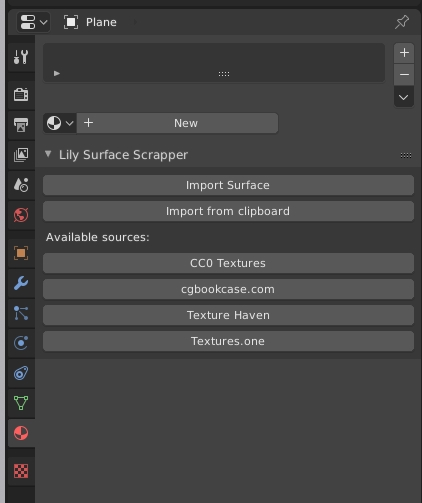
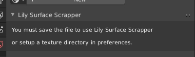
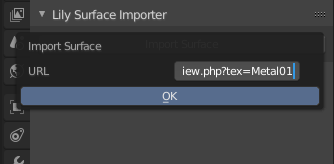
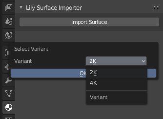
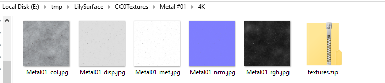
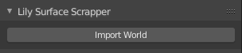

*If this helps you save time or money for your job, please consider supporting the work involved in here ;)* [](https://www.paypal.com/cgi-bin/webscr?cmd=_donations&business=DNEEF8GDX2EV6&currency_code=EUR&source=url)



Lily Surface Scraper
====================

There are many sources for getting PBR textures on the Internet, but it is always a repetitive task to setup the shader once in Blender. Some sources provide an add-on to automatically handle this, but it remains painful to install a new add-on for each of them, and learn over how they slightly differ from the other one.

LilySurfaceScraper suggest a very intuitive and unified workflow: browse your favorite library in your browser. Once you have made your choice, just copy the URL of the page and paste it in Blender. The script will prompt for potential variants if some are detected, then download the maps and setup the material.

This add-on has been designed to make it very easy to add new sources. You can just add a script in the `Scrapers/` directory, it will be automatically detected. See below for more information.

## Links & Resources

- Video demonstration on [YouTube](https://www.youtube.com/watch?v=KfEhjxvia0Q)
- Support thread on [BlenderArtists](https://blenderartists.org/t/2-80-lily-surface-scraper-import-material-from-a-simple-url/1157897)
- [Downloads](https://github.com/eliemichel/LilySurfaceScraper/releases)

## Installation

Download the [latest release](https://github.com/eliemichel/LilySurfaceScraper/releases/latest), then in Blender, go to `Edit > Preferences`, `Add-on`, `Install`, browse to the zip file.

Make sure that you have ticked the small checkbox next to "Import: Lily Surface Scraper", otherwise the add-on will not be active.



### Preferences

You can set a path to your texture library. If the path is in absolute form, like `C:\Users\Suzanne\Pictures`, you will not have to save your blend files before you can use the add-on.

If a path is relative like `image-textures\lily` _LilySurfaceScraper_ searches for a folder named _image-textures_ next to your .blend project file and saves the textures inside _image-textures_ in a subfolder named _lily_.

## Usage

 1. Open the material properies panel.



 2.  If you see this message you need to save your file first or [set an absolute path](#preferences) for your textures.



 3. Browse one of the [supported websites](#supported-sources), until you find a texture, say https://cc0textures.com/view.php?tex=Metal01
 
 4. Copy this URL

 5. Click _Import from Clipboard_ to instantly import the material. Alternatively you can click _Import Surface_ and paste the URL you just copied:



 6. Select the variant, if there is more than one available on the page:



 7. The textures are now being downloaded and the material is being setup. Depending on the resolution and your internet connection this can take a few seconds.

To change where the textures are being stored on the drive, check [Preferences](#preferences). Note that they are not downloaded twice if you use the same URL and variant again.



**NB** The same process is available in the World panel:



## Supported sources

The following sources are supported, feel free to suggest new ones.

Materials:

 - cgbookcase: https://www.cgbookcase.com
 - ambientCG: https://ambientcg.com/
 - Poly Haven Texture: https://polyhaven.com/textures
 - [Your local filesystem](https://www.youtube.com/watch?v=BXbNA3nN_HI)
 - Search on Textures.one: If the "URL" contains just words, no slash, they are used as search keywords to randomly pick a result on https://textures.one. You can also perform the search yourself and provide a link to the result page on Textures.one. Make sure that the link is for a supported texture site.

Worlds:

 - Poly Haven HDRIs: https://polyhaven.com/hdris
 - Search on Textures.one (same as for materials)

Lights:

 - ies library: https://ieslibrary.com/

## Troubleshooting

**Blender hangs forever when downloading the files**  
If you are using a VPN, try to disable it.

**Cannot import name 'etree' from 'lxml'**
We tried to bundle lxml into the add-on to avoid issues, but there are still some people having trouble with it. If you get such an error when activating the add-on, install lxml manually by running the following command line in admin mode (adapt the path to your version and installation location of Blender):

    "C:\Program Files\Blender Foundation\Blender 3.1\3.1\python\bin\python.exe" -m pip install lxml -t "C:\Program Files\Blender Foundation\Blender 3.1\3.1\scripts\modules"
    
Ideally, you could share the folder `C:\Program Files\Blender Foundation\Blender 3.1\3.1\scripts\modules\lxml` that this creates in an issue here so that I can add it to the repo.

**Other**  
If you run into any sort of trouble running this add-on, please fill an [issue](https://github.com/eliemichel/LilySurfaceScraper/issues/new) on this repository.
Please, do not attempt to report problems with the addon to the material and sky sources' websites as they are not involved in this project and I don't want them to receive undue "spam" because of me.

Trouble is to be expected the source websites change their design. Please report it here and be patient so we can fix the addon, or try to propose your own changes (they should be pretty easy to do, see section about new sources below).

## Adding new sources

I tried to make it as easy as possible to add new sources of data. The only thing to do is to add a python file in `Scrapers/` and define in it a class deriving from `AbstractScraper`.

You can start from a copy of [`AmbientCgScraper.py`](https://github.com/eliemichel/LilySurfaceScraper/blob/master/blender/LilySurfaceScraper/Scrapers/AmbientCgScraper.py) or [`CgbookcaseScraper.py`](https://github.com/eliemichel/LilySurfaceScraper/blob/master/blender/LilySurfaceScraper/Scrapers/CgbookcaseScraper.py). The former loads a zip and extracts maps while the second looks for a different URL for each map (base color, normal, etc.).

The following three methods are required:

### canHandleUrl(cls, url)

A static method (just add `@staticmethod` before its definition) that returns `True` only if the scraper recognizes the URL `url`.

### fetchVariantList(self, url)

Return a list of variant names (a list of strings), to prompt the user. This is useful when a single page provides several versions of the material, like different resolutions (2K, 4K, etc.) or front/back textures.

This method may save info like the html page in `self`, to reuse it in `fetchVariant`.

### fetchVariant(self, variant_index, material_data)

Scrap the information of the variant numbered `variant_index`, and write it to `material_data`. The following fields of `material_data` can be filled:

 - `material_data.name`: The name of the texture, typically prefixed by the source, followed by the texture name, then the variant name.
 - `material_data.maps['baseColor']`: The path to the baseColor map, or None
 - `material_data.maps['diffuse']`: The path to the diffuse map, or None
 - `material_data.maps['normal']`: The path to the normal map, or None
 - `material_data.maps['normalInvertedY']`: The path to the normal map, or None
 - `material_data.maps['opacity']`: The path to the opacity map, or None
 - `material_data.maps['roughness']`: The path to the roughness map, or None
 - `material_data.maps['metallic']`: The path to the metallic map, or None
 - `material_data.maps['emission']`: The path to the emission map, or None
 - `material_data.maps['ambientOcclusion']`: The path to the ambient occlusion map, or None
 - `material_data.maps['ambientOcclusionRough']`: The path to the rough ambient occlusion map, or None
 - `material_data.maps['specular']`: The path to the specular map, or None
 - `material_data.maps['glossiness']`: The path to the glossiness map (inverted roughness), or None
 - `material_data.maps['height']`: The path to the height map, or None
 - `material_data.maps['vectorDisplacement']`: The path to the vector displacement map, or None

You can define your own texture maps by adding them to `self.maps` in `MaterialData.py`. You can then assign a texture map that name in your scraper (we, by convention, have a dictionary called `maps_tr` that maps the scraped name onto the internal naming defined in `MaterialData.py`) and translate it to a node setup in for example `CyclesMaterialData.py`.

## Utility functions

To implement these methods, you can rely on the following utils:

### self.fetchHtml(url)

Get the url as a [lxml.etree](https://lxml.de/tutorial.html) object. You can then call the `xpath()` method to explore the page using the very convenient [xpath synthax](https://en.wikipedia.org/wiki/XPath#Examples).

### fetchImage(self, url, material_name, map_name)

Get an image from the URL `url`, place it in a directory whose name is generated from the `material_name`, and call the map `map_name` + extension (if an extension is explicit in the URL). The function returns the path to the downloaded texture, and you can directly provide it to `material_data.maps[...]`.

### fetchZip(self, url, material_name, zip_name)

Get a zip file from the URL `url`. This works like `fetchImage()`, returning the path to the zip file. You can then use the [zipfile](https://docs.python.org/3/library/zipfile.html) module, like [`AmbientCgScraper.py`](https://github.com/eliemichel/LilySurfaceScraper/blob/master/blender/LilySurfaceScraper/Scrapprs/AmbientCgScraper.py) does.

### self.clearString(s)

Remove non printable characters from s

## Advanced use

There are some advanced hidden properties provided in the Lily Surface operators, that may be useful for integration into other scripts or pipelines:

### create_material/create_world

These properties default to True, but can be turned off to prevent the operator from creating a material/world. When it is off, it still download the textures and loads the images in the blend file, but don't affect neither the active object's material nor the world.

### callback_handle

It can be useful to have operations run after the operator. Since it is always painful to do so with the vanilla bpy API, Lily Surface Scraper features a simple callback mechanism. All operators can take a callback as property, a callback being a function called once the operator is done. It recieves one argument, namely the bpy context into which the operator was running.

Since Blender operators cannot take arbitrary values like callbacks as properties, a `register_callback()` utility function is provided to convert the callback into a numeric handle that can then be provided to the operator. The following snippet illustrates the process:

```python
import LilySurfaceScraper

def c(ctx):
    print("Callback running!")
    print(ctx)
    
h = LilySurfaceScraper.register_callback(c)
bpy.ops.object.lily_surface_import(url="https://cc0textures.com/view.php?tex=Metal01", callback_handle=h)
```

